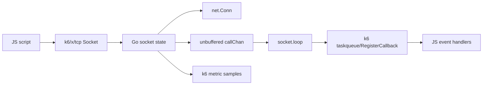
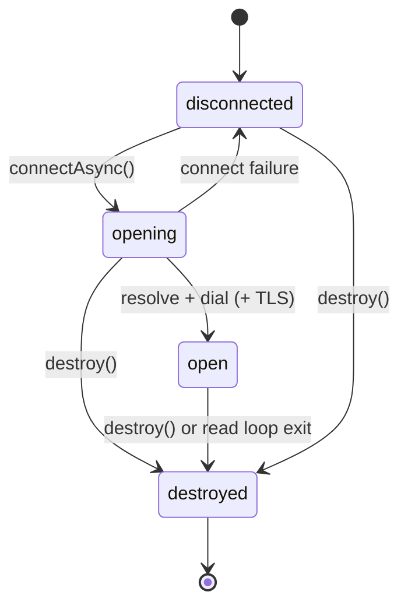
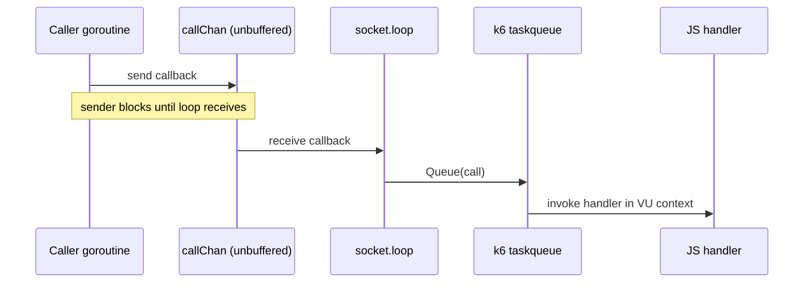

# xk6-tcp Architecture

This document describes how the `xk6-tcp` extension is implemented today.
It is aimed at maintainers and reviewers rather than end users.

## Scope

The main runtime lives in:

- `register.go`
- `tcp/module.go`
- `tcp/socket_base.go`
- `tcp/socket_connect.go`
- `tcp/socket_on.go`
- `tcp/socket_loop.go`
- `tcp/socket_read.go`
- `tcp/socket_write.go`
- `tcp/socket_timeout.go`
- `tcp/socket_state.go`
- `tcp/socket_metrics.go`
- `tcp/metrics.go`

Supporting test and tooling code lives in:

- `internal/echo/`
- `internal/testscript/`
- `tools/with-echo/`

## High-Level Model

The extension registers a single JS module, `k6/x/tcp`, and exposes one main constructor: `Socket`.

Each `Socket` instance is a Go runtime object that owns:

- the active `net.Conn`
- lifecycle state (`disconnected`, `opening`, `open`, `destroyed`)
- registered JS event handlers
- an unbuffered `callChan` used to hand event callbacks to a loop goroutine
- a cancellable socket-scoped context
- per-socket counters, tags, and metric helpers
- a fixed read buffer plus a pooled buffer allocator for dispatched data

The core split is:

- network work happens in Go goroutines
- JS callbacks run later through the k6 VU callback queue



## Module Registration And Construction

Registration happens in `register.go`:

- package `init()` calls `modules.Register(tcp.ImportPath, tcp.New())`

Module creation happens in `tcp/module.go`:

- `tcp.New()` returns a `rootModule`
- `rootModule.NewModuleInstance()` creates one `module` per VU
- `module.Exports()` exposes a single named export: `Socket`

Socket construction happens in `module.socket()` in `tcp/socket_base.go`:

1. `newSocket()` allocates the Go `socket`
2. `s.this = call.This` captures the JS object being constructed
3. Go methods are bound onto `call.This`
4. readonly accessors are attached for state, byte counters, and endpoint info
5. a socket-scoped context is created from `m.vu.Context()`
6. `go s.loop(ctx)` starts immediately
7. the constructor returns `nil`

That final `nil` return is intentional: under sobek constructor semantics, returning `nil` means "use `call.This` as the constructed object."

## Main Runtime Object

The `socket` struct in `tcp/socket_base.go` is the center of the implementation.

Important fields:

- `this`: bound JS object
- `conn`: active `net.Conn`
- `socketOpts`: constructor options such as static tags
- `connectOpts`: most recent connect configuration
- `handlers`: registered event handlers (`sync.Map`)
- `vu`: current k6 VU handle
- `callChan`: unbuffered `chan func() error` for event dispatch
- `cancel`: cancels the socket-scoped context
- `metrics`: registered TCP metric handles
- `endpoints`: cached local/remote address data
- `state`: current lifecycle state
- `timeout`: idle read timeout
- `mu`: protects socket state
- `readBuf`: fixed 4096-byte reusable read buffer
- `bufferPool`: pooled buffers for dispatched `data` payloads
- `destroyOnce`: `sync.Once` guard for teardown

## Lifecycle States

States are defined in `tcp/socket_state.go`:

- `disconnected`
- `opening`
- `open`
- `destroyed`

Typical lifecycle:

1. constructor creates a disconnected socket
2. `connectAsync()` moves the socket to `opening`
3. resolve + dial (+ optional TLS) moves it to `open`
4. read loop exit or explicit `destroy()` moves it to `destroyed`



## Connect Path

The public connect API is `connectAsync()` in `tcp/socket_connect.go`.

### `connectAsync()`

`connectAsync()` creates a Sobek promise with `promises.New()` and then:

1. runs `connectPrepare()`
2. rejects immediately on prepare errors
3. starts a goroutine that runs `connectExecute()`
4. resolves the promise on success, rejects on failure

### `connectPrepare()`

`connectPrepare()` accepts either:

- `connectAsync(port, host?)`
- `connectAsync(options)`

It normalizes arguments into `connectOptions` and stores them on `s.connectOpts`.

### `connectExecute()`

`connectExecute()`:

1. locks `s.mu`
2. sets state to `opening`
3. resolves the address and records resolve metrics
4. dials the TCP connection and records connect metrics
5. optionally wraps the connection with TLS
6. records endpoint info, state, and connection time
7. unlocks `s.mu`
8. fires `connect`
9. starts `go s.read()`
10. records the `tcp_sockets` counter

The ordering of steps 8 and 9 matters. `connect` is queued before the read goroutine starts, so later events from the same lifecycle cannot overtake it.

### TLS

TLS wrapping happens in `wrapTLS()`:

- it requires `s.vu.State().TLSConfig` to be non-nil
- if no TLS config is available, the raw connection is closed and `errNoTLSConfig` is returned
- the config is cloned before mutation
- `ServerName` is set from `connectOpts.Host` if needed
- `NextProtos` is forced to `[]string{"http/1.1"}` to avoid HTTP/2 binary frames in raw socket examples
- the TLS handshake runs with `HandshakeContext(s.vu.Context())`

## Event Model

Supported events are defined in `tcp/socket_on.go`:

- `connect`
- `data`
- `close`
- `error`
- `timeout`

Only one handler is stored per event name. Registering a second handler for the same event overwrites the first one.

## Dispatch Model

The dispatch path spans `tcp/socket_on.go` and `tcp/socket_loop.go`.

### Why `callChan` matters

`callChan` is created as:

```go
make(chan func() error)
```

It is unbuffered. That is the key post-`#24` ordering mechanism.

`fire()` and `fireAndCleanup()` do not spawn per-event goroutines. Instead, they send a closure directly on `callChan`. Because the channel is unbuffered, the sending goroutine blocks until the loop goroutine receives the callback.

### Loop startup

The loop goroutine starts in the constructor, before any connection attempt:

- `go s.loop(ctx)` runs in `module.socket()`

So by the time `connectAsync()` is called, the loop goroutine is already waiting to receive from `callChan`.

### Loop behavior

`socket.loop()`:

1. creates a `taskqueue` using `taskqueue.New(s.vu.RegisterCallback)`
2. waits for either:
   - a callback from `callChan`
   - socket context cancellation
3. passes received callbacks to `tq.Queue()`

The queued callback then runs in the k6 VU event loop.



### Argument conversion

Raw Go event args are converted to `sobek.Value` inside the queued callback, not before sending to `callChan`.
That avoids crossing goroutines with runtime-owned JS values.

### Ordering guarantee

Because:

- `callChan` is unbuffered
- the loop goroutine starts at construction time
- `connectExecute()` calls `s.fire("connect")` before `go s.read()`

the connect path blocks until the loop has received the `connect` callback before the read goroutine can start queueing later lifecycle events.

That is the current mechanism preventing `data`, `error`, or `close` from overtaking `connect` for the same connection lifecycle.

## Read Path

The read loop lives in `tcp/socket_read.go`.

`read()`:

- runs in its own goroutine
- defers `s.destroy()` so loop exit tears the socket down
- snapshots `conn` and `timeout` under lock before blocking reads

`readLoopStep()`:

1. updates the read deadline if a timeout is configured
2. reads into `s.readBuf`
3. on data:
   - increments `tcp_reads`
   - updates `totalRead`
   - gets a pooled buffer
   - copies the bytes into that pooled buffer
   - fires `data` with a cleanup callback that returns the buffer to the pool after the JS handler runs
4. on `io.EOF`, stops the loop cleanly
5. on timeout, fires `timeout` and keeps reading
6. on other errors, routes through `handleError()` and stops

The fixed `readBuf [4096]byte` keeps the read side allocation-light. Bytes are copied into a pooled buffer before dispatch so the reusable read buffer can be used again immediately.

## Write Path

The write path lives in `tcp/socket_write.go`.

`writeAsync()`:

1. creates a Sobek promise
2. normalizes the input with `writePrepare()`
3. starts a goroutine that runs `writeExecute()`
4. resolves or rejects the promise from that goroutine

`writePrepare()` accepts:

- string input
- `Uint8Array` / typed-array input (via exported `[]byte`)
- `ArrayBuffer`

Supported string encodings are:

- `utf8`
- `utf-8`
- `ascii`
- `base64`
- `base64url`
- `hex`

`writeExecute()`:

- snapshots `conn` under lock
- writes in a loop until all bytes are sent or an error occurs
- updates `totalWritten`
- increments `tcp_writes` for every write attempt, including attempts that end in error
- increments `tcp_partial_writes` when a short partial write fails before completion

## Timeout Handling

`setTimeout()` lives in `tcp/socket_timeout.go`.

It stores a per-socket idle timeout and also updates the active connection deadline if one exists.

Important behavior:

- `timeout == 0` disables the deadline
- a timeout emits the `timeout` event
- a timeout does not automatically destroy the socket

## Destroy / Shutdown

Teardown lives in `destroy()` in `tcp/socket_connect.go`.

Important details:

- `destroyOnce.Do(...)` ensures cleanup runs exactly once
- state is moved to `destroyed`
- `conn` is cleared under lock and then closed outside the lock
- duration metrics are emitted if a connection existed
- `close` is fired
- `s.cancel()` stops the loop goroutine

Because `destroy()` is `sync.Once`-guarded, it is safe for multiple call sites to race toward teardown.

## Error Handling

`handleError()` in `tcp/socket_on.go`:

- records `tcp_errors`
- wraps the error in `TCPError`
- tries to emit the `error` event
- returns `nil` if an error handler consumed the problem
- otherwise returns the wrapped error

That means many operations have "soft failure" behavior when an `error` handler is registered.

## Metrics And Tags

Metric definitions live in `tcp/metrics.go`:

- `tcp_socket_connecting`
- `tcp_socket_resolving`
- `tcp_socket_duration`
- `tcp_sockets`
- `tcp_reads`
- `tcp_writes`
- `tcp_errors`
- `tcp_timeouts`
- `tcp_partial_writes`

Tag construction happens in `tcp/socket_metrics.go`:

- base VU tags come from k6 state
- `"proto" = "TCP"` is added
- constructor tags and connect tags are merged in
- host, port, and remote IP are added when available

## Testing And Tooling

### `internal/testscript`

The `internal/testscript` package provides helpers for running JS test files inside Go tests.

Key pieces:

- `RunFile()` / `RunFiles()` / `RunGlob()` compile and run JS scripts in a minimal runtime
- `RunFileIntegration()` and friends run k6 in subprocess mode
- the runtime setup registers JS extensions, injects `__ENV`, and waits for registered async callbacks
- `k6/execution` is stubbed for test usage
- the custom console routes script output into the Go test logger

### `internal/echo`

`internal/echo` provides embedded echo servers used in tests and tooling:

- a TCP echo server
- an HTTP echo server

`echo.Setup()` starts them and exports:

- `TCP_ECHO_HOST`
- `TCP_ECHO_PORT`
- `HTTP_ECHO_HOST`
- `HTTP_ECHO_PORT`
- `HTTP_ECHO_URL`

### `main_test.go`

`TestMain()` calls `echo.Setup()` once for the test process so the JS test scripts can rely on the echo environment.

### `tools/with-echo`

`with-echo` is a CLI wrapper for local manual runs.

It:

1. starts the embedded echo servers
2. exports the same `TCP_ECHO_*` and `HTTP_ECHO_*` variables
3. runs an arbitrary child command
4. forwards signals
5. shuts the servers down when the child exits

## Mental Model For Maintainers

If you keep four things in mind while editing this codebase, they will prevent most confusion:

1. Construction starts the loop goroutine immediately; connection happens later.
2. Event ordering depends on the unbuffered `callChan`, not on per-event goroutines.
3. Reads use a fixed reusable buffer plus pooled copies for JS dispatch.
4. `destroy()` is centralized and `sync.Once`-guarded.
