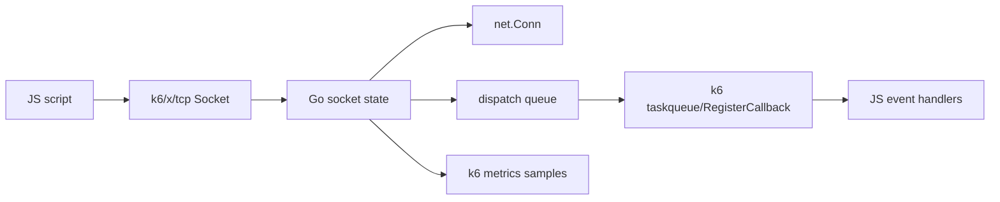
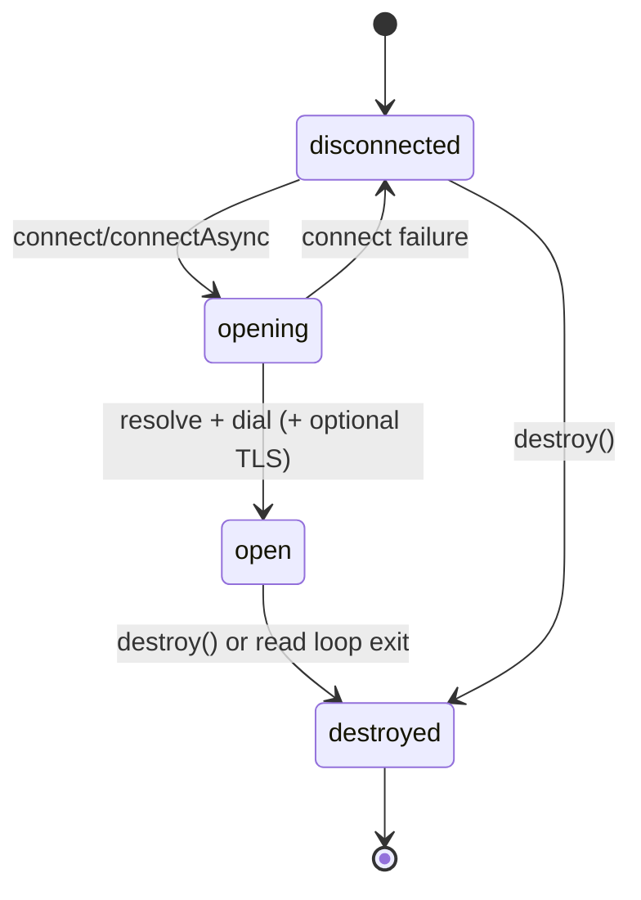
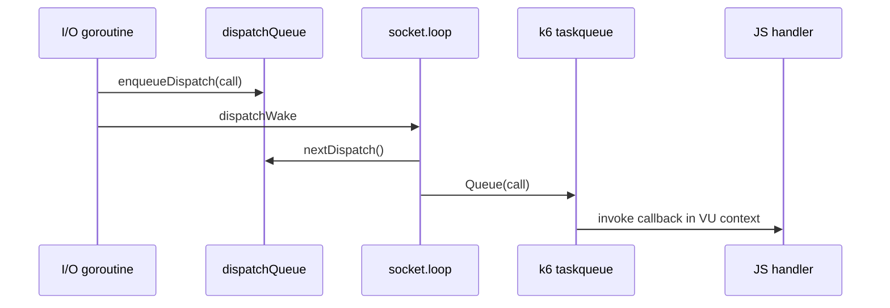

# xk6-tcp Architecture

This document describes how the `xk6-tcp` extension works internally today.
It is intended for maintainers, not end users.

## Scope

The runtime implementation lives mainly in:

- `register.go`
- `tcp/module.go`
- `tcp/socket_base.go`
- `tcp/socket_connect.go`
- `tcp/socket_on.go`
- `tcp/socket_dispatch.go`
- `tcp/socket_loop.go`
- `tcp/socket_read.go`
- `tcp/socket_write.go`
- `tcp/socket_timeout.go`
- `tcp/socket_metrics.go`
- `tcp/metrics.go`

## High-Level Model

`xk6-tcp` exposes a single JS module, `k6/x/tcp`, with one main constructor: `Socket`.

Each `Socket` instance is a small stateful runtime object that owns:

- a TCP connection (`net.Conn`)
- socket state (`disconnected`, `opening`, `open`, `destroyed`)
- JS event handlers (`connect`, `data`, `close`, `error`, `timeout`)
- an internal dispatch queue used to serialize event callbacks back into the VU event loop
- per-socket counters and metadata used for k6 metrics

At a high level, Go does blocking network work and queues JS callbacks; the k6 VU event loop
executes the actual JS handlers.

## Module Registration and Construction

Registration happens in `register.go`:

- package init registers `tcp.New()` under import path `k6/x/tcp`

Module creation happens in `tcp/module.go`:

- `rootModule.NewModuleInstance()` creates one `module` per VU
- the module keeps the VU handle, logger, and metric registry wrappers

Socket construction happens in `tcp/socket_base.go`:

- `module.socket()` is the JS constructor backing `new tcp.Socket(...)`
- it creates a `socket` Go struct
- it binds Go methods onto the JS object:
  - `connect`
  - `connectAsync`
  - `write`
  - `writeAsync`
  - `destroy`
  - `setTimeout`
  - `on`
- it exposes readonly properties via accessors:
  - `ready_state`
  - `bytes_written`
  - `bytes_read`
  - `local_ip`
  - `local_port`
  - `remote_ip`
  - `remote_port`
  - `connected`
- it creates a socket-scoped context derived from `vu.Context()`
- it starts the per-socket dispatch loop in a goroutine

## Main Runtime Objects

The `socket` struct in `tcp/socket_base.go` is the core runtime object.

Important fields:

- `this`: bound JS object
- `conn`: active `net.Conn`
- `socketOpts`: constructor options such as static tags
- `connectOpts`: most recently prepared connect options
- `handlers`: registered JS event handlers
- `cancel`: socket-local cancel function
- `dispatchQueue`: queued event callbacks
- `dispatchWake`: wakeup channel for the dispatch loop
- `metrics`: k6 metric handles
- `endpoints`: local/remote address metadata
- `state`: lifecycle state
- `timeout`: idle read timeout
- `mu`: main socket state lock
- `dispatchMu`: dispatch queue lock
- `bufferPool`: pooled buffers for incoming data
- `destroyOnce`: ensures cleanup is only executed once

## Lifecycle

### States

Defined in `tcp/socket_state.go`:

- `disconnected`
- `opening`
- `open`
- `destroyed`

### Lifecycle Flow

## Connect Path

Implemented in `tcp/socket_connect.go`.

### `connect()`

`connect()` is the synchronous entrypoint.

Flow:

1. `connectPrepare()` parses arguments into `connectOptions`
2. on prepare failure, `handleError()` is called
3. `connectExecute()` performs resolve + dial inline
4. on success:
   - socket state becomes `open`
   - `connect` event is queued
   - the read loop starts in a goroutine
   - socket counters/metrics are updated

### `connectAsync()`

`connectAsync()` creates a Sobek promise via `promises.New()`.

Flow:

1. it runs the same `connectPrepare()`
2. if prepare fails, it rejects the promise
3. otherwise it starts a goroutine
4. that goroutine runs `connectExecute()`
5. on success it resolves the promise, on failure it rejects it

### Resolve / Dial / TLS

`connectExecute()` uses:

- `resolve()`: resolves host and fills remote endpoint info
- `dial()`: opens the TCP connection with the k6 dialer
- `wrapTLS()`: optionally wraps the connection with `tls.Client`

TLS behavior:

- uses the VU TLS config from k6 state
- clones the config before mutation
- sets `ServerName` for SNI if needed
- forces `NextProtos = []string{"http/1.1"}` to avoid HTTP/2 binary frames in examples/tests

## Event Model

Implemented mainly in `tcp/socket_on.go`, `tcp/socket_dispatch.go`, and `tcp/socket_loop.go`.

Supported events:

- `connect`
- `data`
- `close`
- `error`
- `timeout`

### Handler Registration

`on(event, handler)`:

- validates the event name
- stores the handler in `handlers`
- overrides any previous handler for the same event

Only one handler per event is supported today.

### Why a Dispatch Queue Exists

Network I/O happens in Go goroutines, but JS callbacks must run through the VU callback
mechanism. The extension therefore queues event callbacks in Go and then feeds them into
the VU event loop through `taskqueue.New(vu.RegisterCallback)`.

### Dispatch Flow

### Event Conversion

`eventCall()` deliberately converts event arguments to `sobek.Value` inside the dispatched
callback, not before enqueue. This avoids crossing goroutines with JS runtime values.

### Error Handling

`handleError()`:

- logs the error
- emits k6 error metrics
- wraps the error into `TCPError`
- tries to fire the `error` event
- if there is no error handler, it returns the wrapped error to the caller

This means many operations have "soft failure" semantics when an `error` handler is registered.

## Read Path

Implemented in `tcp/socket_read.go`.

Flow:

1. `connectExecute()` starts `go s.read()`
2. `read()` loops while the socket is readable
3. it snapshots `conn` and `timeout` under lock
4. `readLoopStep()` performs one blocking read

For incoming data:

- bytes are read into a fixed reusable array (`readBuf`)
- data is copied into a pooled buffer from `bufferPool`
- a `data` event is queued
- the cleanup callback returns the pooled buffer after the JS callback runs

For special conditions:

- `io.EOF`: stop the read loop
- timeout error: fire `timeout`, keep reading
- other errors: route through `handleError()`, then stop the read loop

The read goroutine defers `destroy()`, so exiting the read loop tears the socket down.

## Write Path

Implemented in `tcp/socket_write.go`.

Flow:

1. `writePrepare()` normalizes input into `[]byte`
2. supported inputs:
   - string
   - `[]byte`
   - `ArrayBuffer`
3. supported string encodings:
   - `utf8`
   - `utf-8`
   - `ascii`
   - `base64`
   - `hex`
4. `writeExecute()` writes all bytes, handling partial writes in a loop

Both sync and async variants exist:

- `write()` returns `(bool, error)` into the JS binding layer
- `writeAsync()` uses a Sobek promise

Write-side metrics:

- `tcp_writes`
- `tcp_partial_writes`
- byte counters in `bytes_written`

## Timeout Handling

Implemented in `tcp/socket_timeout.go`.

`setTimeout(timeoutMs)`:

- stores a per-socket idle timeout
- updates the read deadline on the active connection if one exists
- `timeout == 0` disables the deadline

Read timeouts do not destroy the socket automatically. They only queue the `timeout` event.

## Destroy / Shutdown

Implemented in `tcp/socket_connect.go` (`destroyWithError()` / `destroy()`).

Flow:

1. optional JS error passed to `destroy(error)` triggers a best-effort `error` event first
2. `destroyOnce` ensures teardown runs once
3. state becomes `destroyed`
4. `conn` is cleared and closed
5. duration metrics are emitted
6. final `close` callback is appended to the dispatch queue
7. socket context is cancelled so the dispatch loop can stop after draining accepted events

The dispatch loop (`tcp/socket_loop.go`) keeps consuming queued events until `nextDispatch()`
returns false.

## Synchronization Model

There are two main synchronization domains.

### `mu`

Used for socket state:

- lifecycle state
- `conn`
- timeout
- endpoint metadata

Typical uses:

- state transitions in connect/destroy
- property accessors
- read loop snapshots of `conn` and `timeout`

### `dispatchMu`

Used for callback queue state:

- `dispatchQueue`
- `dispatchClosed`

Typical uses:

- enqueueing events
- appending final `close`
- draining queued callbacks

### Design Intent

The implementation avoids holding `mu` during blocking network I/O.

Common pattern:

1. copy the needed pointer/value under lock
2. release the lock
3. do the blocking operation

This pattern is used in both read and write paths.

## Metrics

Metric definitions are in `tcp/metrics.go`.

Per-socket / per-operation metrics are emitted from connect, read, write, timeout, and error paths.

Important metrics:

- `tcp_socket_resolving`
- `tcp_socket_connecting`
- `tcp_socket_duration`
- `tcp_sockets`
- `tcp_reads`
- `tcp_writes`
- `tcp_errors`
- `tcp_timeouts`
- `tcp_partial_writes`

Tag composition happens in `tcp/socket_metrics.go`:

- base VU tags from k6
- static socket tags
- connect tags from `connectOpts`
- connection metadata such as host, port, and IP

## Testing Architecture

There are two layers of tests.

### Go Unit / Helper Tests

Under `tcp/*_test.go`.

These cover:

- helper functions
- socket state behavior
- read loop behavior
- event dispatch behavior
- TLS helper behavior
- concurrency/race-sensitive code paths

### JS-Level Script Tests

Under `test/*.test.js`.

These are run through the local test harness in `internal/testscript`.

`internal/testscript`:

- compiles JS files with the k6 runtime
- injects registered JS extensions
- executes `module.exports.default`
- waits for registered async callbacks to complete

### Embedded Test Servers

The integration tests use local helpers instead of external infrastructure.

- `internal/echo` provides embedded TCP and HTTP echo servers
- `main_test.go` starts:
  - the echo server
  - a small banner server used for ordering/integration tests

Environment variables such as `TCP_ECHO_HOST`, `TCP_ECHO_PORT`, and `TCP_BANNER_PORT` are
set for the test scripts.

## Current Design Tradeoffs

The current committed design is intentionally simple, but there are a couple of important
tradeoffs to remember:

- `connectPrepare()` stores its result in socket-wide `connectOpts`
  - overlapping connect attempts can therefore interfere with each other
- the dispatch queue is unbounded
  - event order is preserved, but a sufficiently slow consumer can let queued callbacks
    and retained buffers grow without an explicit limit
- only one handler per event is supported

These are known maintainability points, not hidden implementation details.

## Mental Model for Maintainers

If you only keep three things in mind while working in this codebase, they should be:

1. Go performs network work, JS handlers always run later through the dispatch queue.
2. `mu` protects socket state; `dispatchMu` protects callback scheduling.
3. Read loop exit implies teardown, because `read()` defers `destroy()`.
